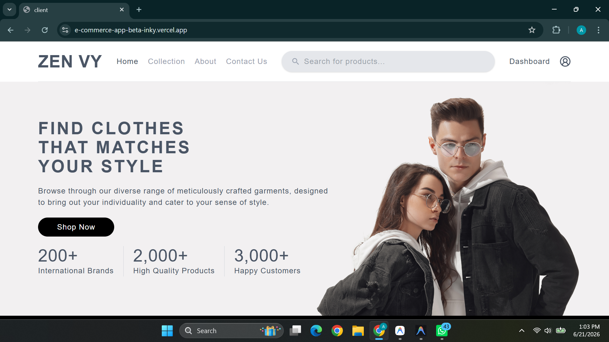
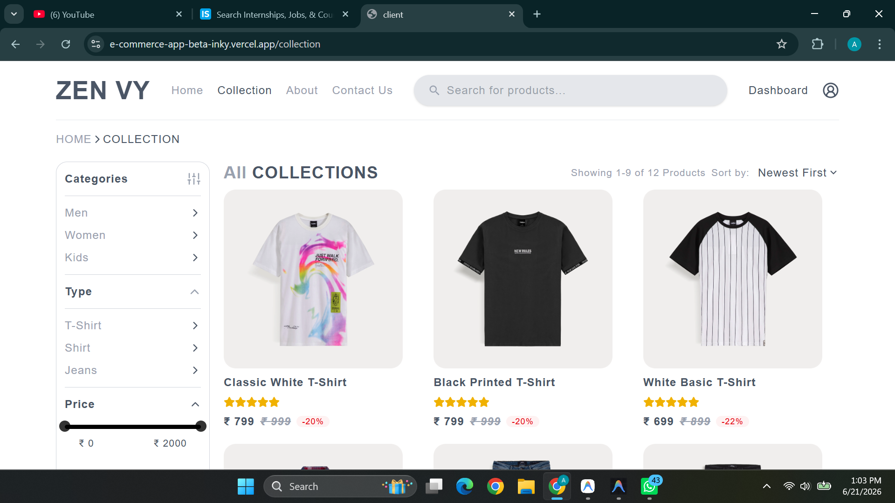
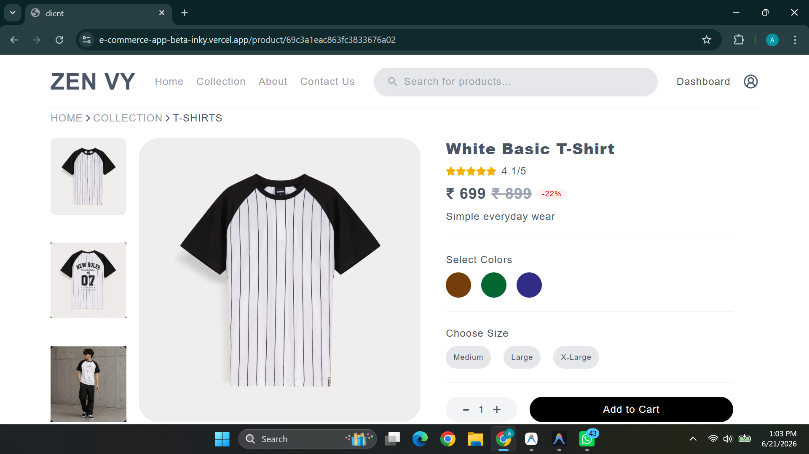
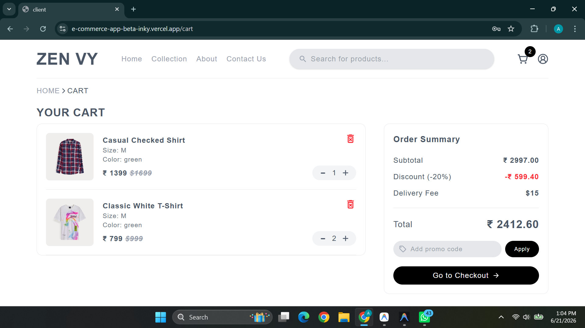
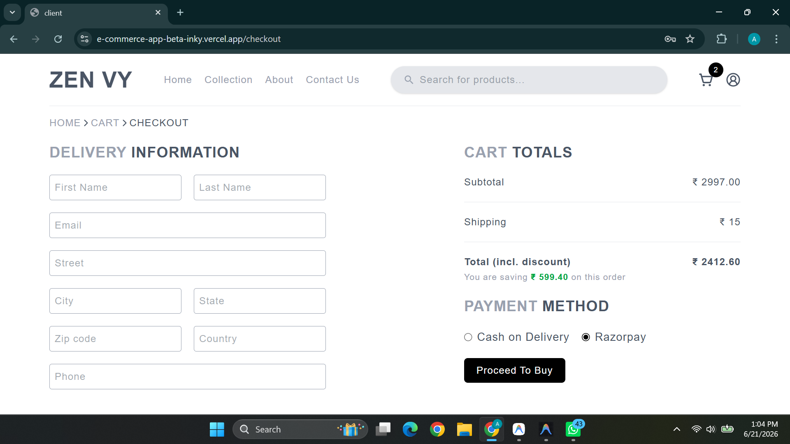
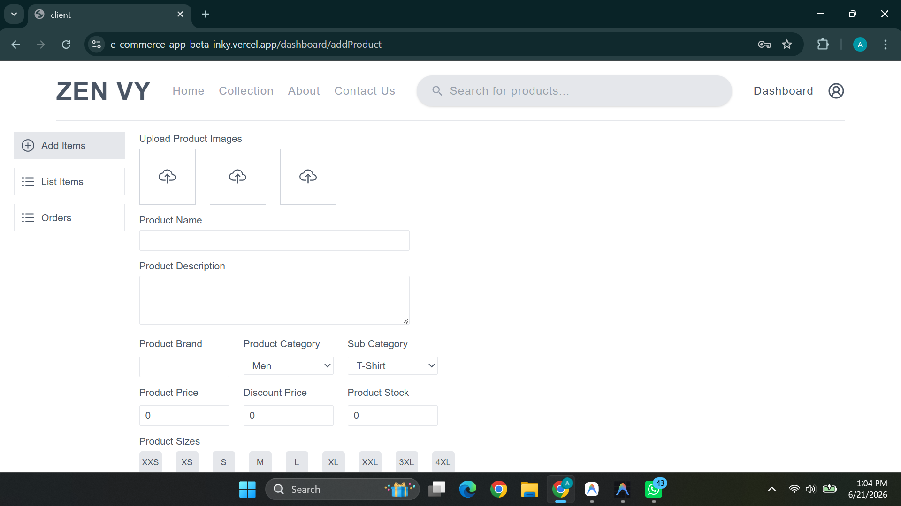

# ZEN VY — Full-Stack E-Commerce Platform

> A modern, production-style clothing e-commerce application built with the MERN stack. Browse collections, manage carts, checkout with Razorpay, and administer inventory through a role-based admin dashboard.

[](https://e-commerce-app-beta-inky.vercel.app) · [](https://github.com/aryan9870/E-commerce-App)

---

## Table of Contents

- [Project Description](#project-description)
- [Features](#features)
- [Tech Stack](#tech-stack)
- [Project Architecture](#project-architecture)
- [Installation Guide](#installation-guide)
- [Environment Variables](#environment-variables)
- [Usage Instructions](#usage-instructions)
- [API Endpoints](#api-endpoints)
- [Screenshots](#screenshots)
- [Challenges Solved](#challenges-solved)
- [Future Improvements](#future-improvements)
- [Deployment Instructions](#deployment-instructions)
- [Author](#author)

---

## Project Description

**ZEN VY** is a full-stack e-commerce web application focused on fashion and apparel retail. The platform delivers a complete shopping experience—from product discovery and filtering to secure checkout and order tracking—while giving administrators the tools to manage catalog inventory and fulfillment workflows.

The frontend is a responsive React single-page application styled with Tailwind CSS, featuring a polished storefront (hero section, product grids, collection filters, and product detail pages) alongside authenticated user flows for cart management, checkout, and order history. State is managed with Zustand stores for authentication, cart, products, and UI loading states.

The backend is a RESTful Express API backed by MongoDB. It handles user authentication via JWT stored in HTTP-only cookies, product CRUD with Cloudinary image uploads, persistent server-side carts, Razorpay payment integration with signature verification, and role-based access control separating regular users from admins.

This project demonstrates end-to-end full-stack development skills: API design, database modeling, secure authentication, third-party payment and media integrations, and a component-driven frontend architecture suitable for portfolio and recruiter review.

---

## Features

### Storefront & Shopping

- **Home page** with hero banner, brand marquee, and curated product sections (New Arrivals & Top Selling)
- **Product collection** with client-side filtering by category, type, price range, and size
- **Sorting** by newest, highest rated, and price (low-to-high / high-to-low)
- **Pagination** (9 products per page) on the collection grid
- **Debounced search** across product name, category, sub-category, and brand
- **Product detail pages** with image gallery, size/color selection, quantity controls, and similar product recommendations
- **Star ratings display** on product cards and detail views

### Authentication & User Account

- User **registration** and **login** with bcrypt password hashing
- **JWT session management** using secure HTTP-only cookies (7-day expiry)
- **Persistent auth check** on app load via `/users/is-auth`
- **Logout** with cookie clearing and cart state reset
- **Role-based routing** — admin users access the dashboard; regular users see the cart

### Cart & Checkout

- **Server-persisted cart** tied to authenticated users
- Add items with product ID, quantity, size, and color
- **Smart cart merging** — duplicate product + size + color combinations increment quantity
- Update quantity (increment/decrement), remove items, and clear cart
- **Checkout flow** with delivery address form and order summary (subtotal, 20% discount, shipping)
- **Razorpay payment integration** with server-side HMAC signature verification
- **Order history** page showing status, date, and item summaries

### Admin Dashboard

- Protected **admin-only routes** (`role: "admin"`)
- **Add products** with multi-image upload (3 images), sizes, pricing, stock, and featured flag
- **List and delete products** from inventory
- **Order management API** (fetch all orders, update status) — admin UI partially implemented

### Backend & Security

- **Joi validation** on request bodies for users, products, cart, orders, and reviews
- **Multer** in-memory image upload with type and size (2 MB) limits
- **Cloudinary** integration for product image storage
- Centralized **error handling** middleware with consistent JSON responses
- **CORS** configured for client origin with credentials support

---

## Tech Stack

### Frontend (`client/`)

| Technology | Purpose |
|---|---|
| [React 19](https://react.dev/) | UI library |
| [Vite 7](https://vitejs.dev/) | Build tool & dev server |
| [Tailwind CSS 4](https://tailwindcss.com/) | Utility-first styling |
| [React Router 7](https://reactrouter.com/) | Client-side routing |
| [Zustand](https://zustand-demo.pmnd.rs/) | Lightweight state management |
| [Axios](https://axios-http.com/) | HTTP client |
| [React Hot Toast](https://react-hot-toast.com/) | Toast notifications |
| [React Icons](https://react-icons.github.io/react-icons/) | Icon library |
| [rc-slider](https://github.com/react-component/slider) | Price range filter slider |
| [Razorpay Checkout](https://razorpay.com/docs/payments/payment-gateway/web-integration/standard/) | Payment gateway (client SDK) |

### Backend (`server/`)

| Technology | Purpose |
|---|---|
| [Node.js](https://nodejs.org/) | Runtime |
| [Express 5](https://expressjs.com/) | Web framework |
| [MongoDB](https://www.mongodb.com/) + [Mongoose 9](https://mongoosejs.com/) | Database & ODM |
| [JWT](https://jwt.io/) | Authentication tokens |
| [bcrypt](https://www.npmjs.com/package/bcrypt) | Password hashing |
| [Joi](https://joi.dev/) | Request validation |
| [Multer](https://github.com/expressjs/multer) | File upload handling |
| [Cloudinary](https://cloudinary.com/) | Cloud image storage |
| [Razorpay](https://razorpay.com/) | Payment processing |
| [cookie-parser](https://www.npmjs.com/package/cookie-parser) | Cookie parsing |
| [CORS](https://www.npmjs.com/package/cors) | Cross-origin resource sharing |

---

## Project Architecture

This is a **monorepo** with separate `client/` and `server/` directories communicating over a REST API.

```
E-commerce-App/
├── client/                          # React frontend (Vite)
│   ├── public/
│   ├── src/
│   │   ├── assets/                  # Static images, brand logos, mock data
│   │   ├── components/              # Reusable UI components
│   │   │   ├── Navbar.jsx           # Navigation, search, cart badge, auth menu
│   │   │   ├── Hero.jsx             # Landing hero section
│   │   │   ├── Filter.jsx           # Category, type, price, size filters
│   │   │   ├── ProductGrid.jsx      # Filtered/sorted/paginated product grid
│   │   │   ├── ProductCard.jsx      # Individual product card
│   │   │   ├── SearchBar.jsx        # Debounced product search
│   │   │   ├── PaymentButton.jsx    # Razorpay checkout handler
│   │   │   ├── CartItems.jsx        # Cart line items
│   │   │   └── ...
│   │   ├── pages/                   # Route-level page components
│   │   │   ├── Home.jsx
│   │   │   ├── Collection.jsx
│   │   │   ├── Product.jsx
│   │   │   ├── Cart.jsx
│   │   │   ├── CheckOut.jsx
│   │   │   ├── MyOrder.jsx
│   │   │   ├── Login.jsx / Signup.jsx
│   │   │   ├── Dashboard.jsx        # Admin layout (nested routes)
│   │   │   ├── AddProduct.jsx
│   │   │   ├── ListItems.jsx
│   │   │   └── Orders.jsx
│   │   ├── store/                   # Zustand state stores
│   │   │   ├── useAuthStore.js
│   │   │   ├── useCartStore.js
│   │   │   ├── useProductStore.js
│   │   │   └── useUIStore.js
│   │   ├── App.jsx                  # Root router & layout
│   │   └── main.jsx                 # Entry point
│   ├── index.html
│   ├── vite.config.js
│   └── package.json
│
└── server/                          # Express backend
    ├── config/
    │   ├── db.js                    # MongoDB connection
    │   ├── cloudinary.js            # Image upload helper
    │   └── razorpay.js              # Razorpay instance
    ├── controllers/                 # Route handlers
    │   ├── userController.js
    │   ├── productController.js
    │   ├── cartController.js
    │   └── orderController.js
    ├── middlewares/
    │   ├── authMiddleware.js        # JWT + admin guard
    │   ├── validate.js              # Joi validation wrapper
    │   └── multer.js                # Image upload config
    ├── models/                      # Mongoose schemas
    │   ├── userSchema.js
    │   ├── productSchema.js
    │   ├── cartSchema.js
    │   └── orderSchema.js
    ├── routes/                      # Express routers
    │   ├── userRoute.js
    │   ├── productRoute.js
    │   ├── cartRoute.js
    │   └── orderRoute.js
    ├── validations/                 # Joi schemas
    ├── utils/
    │   └── errorHandler.js
    ├── server.js                    # App entry point
    └── package.json
```

### Data Flow Overview

```
┌─────────────┐     HTTP + Cookies      ┌─────────────┐     Mongoose     ┌─────────────┐
│   React     │ ◄──────────────────────► │   Express   │ ◄──────────────► │   MongoDB   │
│   Client    │     /api/v1/*           │   Server    │                  │             │
└─────────────┘                         └──────┬──────┘                  └─────────────┘
                                               │
                                    ┌──────────┴──────────┐
                                    │                     │
                              ┌─────▼─────┐        ┌──────▼──────┐
                              │ Cloudinary │        │  Razorpay   │
                              │  (Images)  │        │ (Payments)  │
                              └───────────┘        └─────────────┘
```

---

## Installation Guide

### Prerequisites

- [Node.js](https://nodejs.org/) v18 or higher
- [MongoDB](https://www.mongodb.com/) (local instance or [MongoDB Atlas](https://www.mongodb.com/atlas) cluster)
- [Cloudinary](https://cloudinary.com/) account (free tier works)
- [Razorpay](https://razorpay.com/) test account (for payments)

### 1. Clone the repository

```bash
git clone https://github.com/aryan9870/E-commerce-App.git
cd E-commerce-App
```

### 2. Install backend dependencies

```bash
cd server
npm install
```

### 3. Install frontend dependencies

```bash
cd ../client
npm install
```

### 4. Configure environment variables

Create a `.env` file in the `server/` directory and a `.env` file in the `client/` directory (see [Environment Variables](#environment-variables) below).

### 5. Start the development servers

**Terminal 1 — Backend:**

```bash
cd server
npm run dev
```

The API runs at `http://localhost:5000`.

**Terminal 2 — Frontend:**

```bash
cd client
npm run dev
```

The app runs at `http://localhost:5173`.

### 6. Create an admin user (optional)

Register a user through the app, then update their role in MongoDB:

```js
db.users.updateOne({ email: "your@email.com" }, { $set: { role: "admin" } })
```

---

## Environment Variables

### Server (`server/.env`)

```env
# Server
PORT=5000
NODE_ENV=development
CLIENT_URL=http://localhost:5173

# Database
MONGO_URI=mongodb://127.0.0.1:27017/zen-vy-ecommerce
# MONGO_URI=mongodb+srv://<username>:<password>@cluster.mongodb.net/zen-vy-ecommerce

# Authentication
JWT_SECRET=your_super_secret_jwt_key_here
JWT_EXPIRE=7d

# Cloudinary (Image Upload)
CLOUDINARY_CLOUD_NAME=your_cloud_name
CLOUDINARY_API_KEY=your_api_key
CLOUDINARY_API_SECRET=your_api_secret

# Razorpay (Payments)
RAZORPAY_KEY_ID=rzp_test_xxxxxxxxxx
RAZORPAY_KEY_SECRET=your_razorpay_secret
```

### Client (`client/.env`)

```env
VITE_API_URL=http://localhost:5000/api/v1
VITE_RAZORPAY_KEY_ID=rzp_test_xxxxxxxxxx
```

> **Note:** Never commit `.env` files to version control. Both `client/.gitignore` and `server/.gitignore` already exclude them.

---

## Usage Instructions

### For Shoppers

1. **Browse** the home page or navigate to **Collection** to explore all products.
2. Use **filters** (category, type, price, size) and **sort options** to narrow results.
3. Use the **search bar** in the navbar to find products by name, brand, or category.
4. Click a product to view details — select **color**, **size**, and **quantity**, then **Add to Cart**.
5. **Sign up** or **log in** to persist your cart on the server.
6. Open the **cart**, review items, and proceed to **Checkout**.
7. Fill in your **delivery address**, select **Razorpay** as the payment method, and click **Proceed To Buy**.
8. Complete payment in the Razorpay modal — on success, view your order under **My Orders**.

### For Admins

1. Log in with an account that has `role: "admin"`.
2. Click **Dashboard** in the navbar.
3. **Add Items** — upload 3 product images, fill in details, select sizes, and submit.
4. **List Items** — view all products and delete items from inventory.
5. Use the **Orders** API endpoints to manage fulfillment (admin orders UI is in progress).

### Build for Production

```bash
# Frontend
cd client
npm run build        # Output in client/dist/
npm run preview      # Preview production build locally

# Backend
cd server
npm start            # Runs server.js (ensure NODE_ENV=production)
```

---

## API Endpoints

Base URL: `http://localhost:5000/api/v1`

| Method | Endpoint | Auth | Description |
|---|---|---|---|
| **Users** |
| `POST` | `/users/register` | Public | Register a new user |
| `POST` | `/users/login` | Public | Log in and receive JWT cookie |
| `GET` | `/users/logout` | User | Log out and clear cookie |
| `GET` | `/users/is-auth` | User | Check current authenticated session |
| **Products** |
| `GET` | `/products` | Public | Get all products (`?q=` for search) |
| `GET` | `/products/:id` | Public | Get single product by ID |
| `POST` | `/products` | Admin | Create product (multipart/form-data, images) |
| `DELETE` | `/products/:id` | Admin | Delete a product |
| `POST` | `/products/:id/review` | User | Add a review to a product |
| `DELETE` | `/products/:id/review/:reviewId` | User/Admin | Delete a review |
| `GET` | `/products/:id/similar` | Public | Get similar products by sub-category |
| **Cart** |
| `GET` | `/carts` | User | Get user's cart (populated with products) |
| `POST` | `/carts` | User | Add item to cart |
| `PUT` | `/carts/:productId` | User | Update quantity (`operation`: `increment` / `decrement`) |
| `DELETE` | `/carts/:productId` | User | Remove item from cart |
| `DELETE` | `/carts` | User | Clear entire cart |
| **Orders** |
| `POST` | `/orders` | User | Create Razorpay order |
| `POST` | `/orders/verify` | User | Verify payment & save order |
| `GET` | `/orders/my-orders` | User | Get logged-in user's orders |
| `GET` | `/orders/:id` | User | Get single order by ID |
| `GET` | `/orders` | Admin | Get all orders |
| `PUT` | `/orders/:id` | Admin | Update order status (`pending` / `shipped` / `delivered`) |

### Example Requests

**Register:**

```bash
curl -X POST http://localhost:5000/api/v1/users/register \
  -H "Content-Type: application/json" \
  -d '{"name":"John Doe","email":"john@example.com","password":"secret123"}'
```

**Search products:**

```bash
curl "http://localhost:5000/api/v1/products?q=jeans"
```

**Add to cart** (requires auth cookie):

```bash
curl -X POST http://localhost:5000/api/v1/carts \
  -H "Content-Type: application/json" \
  -b "token=<jwt_cookie>" \
  -d '{"productId":"<product_id>","quantity":1,"size":"M","color":"brown"}'
```

---

## Screenshots

> Replace the placeholder paths below with your actual screenshot files (e.g., store them in `/docs/screenshots/`).

| Page | Preview |
|---|---|
| **Home** |  |
| **Collection** |  |
| **Product Detail** |  |
| **Cart** |  |
| **Checkout** |  |
| **Admin Dashboard** |  |

---

## Challenges Solved

| Challenge | Solution |
|---|---|
| **Secure authentication without exposing tokens** | JWT stored in HTTP-only cookies with `secure` and `sameSite` flags configured per environment |
| **Payment security** | Razorpay order creation on the server; HMAC-SHA256 signature verification before persisting orders |
| **Image upload pipeline** | Multer memory storage → Cloudinary upload stream → URL stored in MongoDB (no local disk dependency) |
| **Cart item deduplication** | Server-side logic matches product ID + size + color before creating duplicate line items |
| **Role-based access** | `isLoggedIn` and `isAdmin` middleware guards protect routes; frontend conditionally renders admin dashboard routes |
| **Input validation** | Centralized Joi validation middleware ensures consistent request validation across all endpoints |
| **Cross-origin auth** | CORS configured with `credentials: true` and explicit client origin whitelist |
| **Responsive UX** | Mobile filter modal, collapsible navbar menu, and Tailwind responsive breakpoints throughout |

---

## Future Improvements

- [ ] Complete the **admin Orders UI** (backend API is ready; frontend page is a placeholder)
- [ ] Add a **product review UI** on the frontend (API endpoints already exist)
- [ ] Implement **Cash on Delivery (COD)** flow (UI present; currently disabled in favor of Razorpay)
- [ ] Add **protected route wrappers** for checkout, cart, and order pages
- [ ] Server-side **pagination and filtering** for large product catalogs
- [ ] **Order detail page** (`/order/:id` route referenced but not yet registered)
- [ ] **Email notifications** for order confirmation and status updates
- [ ] **Wishlist** functionality
- [ ] **Inventory sync** — decrement stock on successful order placement
- [ ] **Unit and integration tests** for API routes and critical user flows
- [ ] Remove unused **Stripe** dependency or integrate as an alternate payment method

---

## Deployment Instructions

### Backend (Render / Railway / Fly.io)

1. Push the `server/` directory to your hosting provider.
2. Set all environment variables from [Server `.env`](#server-serverenv).
3. Set `NODE_ENV=production` and update `CLIENT_URL` to your deployed frontend URL.
4. Use a MongoDB Atlas connection string for `MONGO_URI`.
5. Start command: `npm start`

### Frontend (Vercel / Netlify)

1. Connect the `client/` directory to your hosting provider.
2. Set build command: `npm run build`
3. Set output directory: `dist`
4. Add environment variables:
   - `VITE_API_URL=https://your-api-domain.com/api/v1`
   - `VITE_RAZORPAY_KEY_ID=your_razorpay_key_id`
5. Deploy.

### Post-Deployment Checklist

- [ ] Update CORS `CLIENT_URL` on the server to match the production frontend URL
- [ ] Switch Razorpay from test keys to live keys
- [ ] Verify cookie `sameSite: "none"` and `secure: true` work over HTTPS
- [ ] Test the full checkout flow end-to-end in production

---

## Author

**Aryan**

- GitHub: [@aryan9870](https://github.com/aryan9870)
- Email: [aryan7017n@gmail.com](mailto:aryan7017n@gmail.com)
- Repository: [E-commerce-App](https://github.com/aryan9870/E-commerce-App)

---

<p align="center">
  Built with React, Express, MongoDB, and Razorpay · © 2026 ZEN VY
</p>
